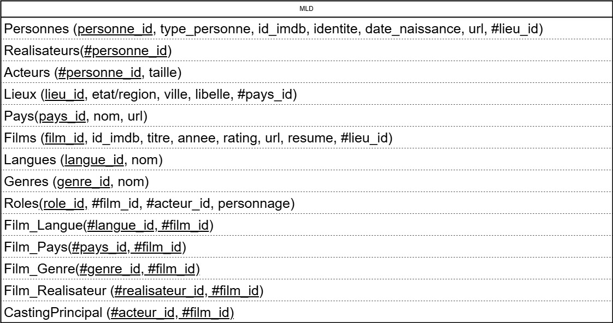

# Project JPA: IMDB Data Importer

## Overview

This application reads raw IMDB-like data from JSON files and persists it into a relational database using Java, JPA, and Hibernate.  
It is designed for efficient and controlled data import and demonstrates best practices in database modeling, JPA entity mapping, and data processing.

---

## Features

-   **Controlled Import:** Control for each entry to avoid duplicates.
-   **JPA/Hibernate:** Uses modern Java persistence best practices.
-   **Normalized Data Model:** Follows a well-structured, normalized schema.
-   **Extensible:** Easily adaptable for additional data sources or schema changes.
-   **Clear Separation:** DTOs, entities, and mappers are cleanly separated.

---

## Data Model

The application is based on a normalized data model inspired by IMDB, supporting films, people (actors, directors), genres, languages, and more.

### Conceptual Model (MCD)


### Logical Model (MLD)



### Physical Model (MPD)


---

## Technologies Used

-   **Java 17+**
-   **JPA (Hibernate)**
-   **Jackson (for JSON parsing)**
-   **MySQL**
-   **Maven**
-   **LogBack (for log generation)**
-   **Jupiter (unit testing)**
-   **Mockito**

---

## Getting Started

### Prerequisites

-   Java 17 or higher
-   Maven or Gradle
-   A supported RDBMS (H2, MySQL, PostgreSQL, etc.)

### Setup

1. **Clone the repository:**

    ```bash
    git clone https://github.com/yourusername/project-jpa-imdb.git
    cd project-jpa-imdb
    ```

2. **Configure the database:**

    - Edit `src/main/resources/application.properties` (or `persistence.xml`) to set your database connection.

3. **Place your data files:**

    - Put your JSON data files in `data/<file.json>` at the root of your project.

4. **Build the project:**

    ```bash
    mvn clean install
    ```

5. **Run the application:**
    ```bash
    mvn exec:java -Dexec.mainClass="fr.diginamic.geoff.App"
    ```

---

## Usage

-   The application will read the JSON files, map them to DTOs, convert them to entities, and persist them in the database.
-   Progress and errors will be logged to log files.

---

## Project Structure

```
src/main/
├── java/                         # Java source code
│   └── fr/diginamic/geoff/       # Main application package
│       ├── App.java              # Main entry point of the application
│       ├── dao/                  # Data Access Objects (database operations)
│       ├── dto/                  # Data Transfer Objects (for data exchange)
│       │   └── deserializer/     # Custom deserializers for DTOs
│       ├── entity/               # JPA entity classes (database models)
│       ├── exception/            # Custom exception classes
│       ├── mapper/               # Mappers for converting between DTOs and entities
│       ├── service/              # Service layer (business logic)
│       └── utils/                # Utility/helper classes
│           ├── JsonParser.java   # Utility for parsing JSON files
│           ├── LieuUtils.java    # Utility for location-related helpers
│           ├── PaysUtils.java    # Utility for country-related helpers
│           └── StringUtils.java  # Utility for string manipulation
└── resources/
    ├── META-INF/
    │   └── persistence.xml       # JPA persistence configuration
    └── logback.xml               # Logging configuration (Logback)
```